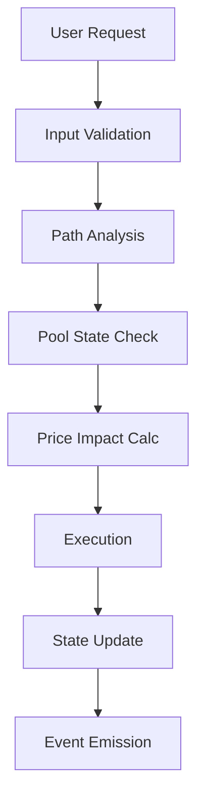

# System Architecture 🏗️

## Overview

The BofhContract system is designed with modularity, security, and mathematical precision in mind. This document details the architectural decisions and their rationale.

## Component Architecture 📊

```
BofhContract
├── Core Contracts
│   ├── BofhContractBase
│   ├── BofhContractV2
│   ├── MathLib
│   ├── PoolLib
│   └── SecurityLib
├── Interfaces
│   └── ISwapInterfaces
└── Mock Contracts
    ├── MockToken
    ├── MockPair
    └── MockFactory
```

### Core Components Detailed Analysis 🔍

#### 1. BofhContractBase
- Base contract implementing core functionality
- Security features and access control
- Event system and state management
- Risk parameter management

Key Design Decisions:
```solidity
abstract contract BofhContractBase {
    SecurityLib.SecurityState internal securityState;
    // ... other state variables
}
```

Rationale:
- Separation of concerns
- Upgradability support
- Clear security boundaries

#### 2. BofhContractV2
- Main implementation contract
- Swap execution logic
- Path optimization
- Price impact management

Architecture Pattern:
```solidity
contract BofhContractV2 is BofhContractBase {
    using MathLib for uint256;
    using PoolLib for PoolLib.PoolState;
    // ... implementation
}
```

Benefits:
- Clear inheritance hierarchy
- Library utilization for specialized functions
- Gas optimization through library usage

#### 3. Library System 📚

##### MathLib
- Mathematical operations
- Optimization algorithms
- Numerical methods

Design Philosophy:
```solidity
library MathLib {
    // Pure functions for mathematical operations
    // No state modifications
    // Gas-optimized implementations
}
```

##### PoolLib
- Pool state management
- Liquidity analysis
- Price impact calculations

Implementation Strategy:
```solidity
library PoolLib {
    struct PoolState {
        // Comprehensive pool state
    }
    // Pool analysis functions
}
```

##### SecurityLib
- Access control
- Safety checks
- Rate limiting

Security Pattern:
```solidity
library SecurityLib {
    struct SecurityState {
        // Security-related state
    }
    // Security enforcement functions
}
```

## Data Flow Architecture 🔄

### 1. Swap Execution Flow



### 2. State Management

#### Contract State
- Immutable parameters
- Mutable state variables
- Security settings

#### Pool State
- Reserve tracking
- Price impact history
- Volatility metrics

## Gas Optimization Architecture ⚡

### 1. Storage Optimization
- Packed storage slots
- Minimal state variables
- Efficient data structures

Example:
```solidity
// Packed struct for gas efficiency
struct PackedState {
    uint128 amount;
    uint64 timestamp;
    uint64 flags;
}
```

### 2. Computation Optimization
- Library usage for common operations
- Memory vs. Storage optimization
- Assembly for critical paths

## Security Architecture 🛡️

### 1. Access Control Layer
- Role-based permissions
- Time-locked operations
- Emergency controls

### 2. Safety Checks
- Reentrancy protection
- Overflow prevention
- Bounds checking

### 3. Circuit Breakers
- Volume limits
- Price impact limits
- Rate limiting

## Testing Architecture 🧪

### 1. Test Categories
- Unit tests
- Integration tests
- Gas optimization tests
- Security tests

### 2. Mock System
- Simulated environment
- Controlled testing
- Edge case verification

## Upgrade Architecture 🔄

### 1. Upgrade Mechanism
- Proxy pattern support
- State migration capability
- Version control

### 2. Backward Compatibility
- Interface stability
- State preservation
- Event compatibility

## Performance Considerations 🚀

### 1. Gas Usage
- Optimized function calls
- Efficient data structures
- Minimal storage operations

### 2. Execution Speed
- Path optimization
- Parallel computation where possible
- Efficient algorithms

## Future Extensibility 🔮

### 1. Extension Points
- Module system
- Plugin architecture
- Custom path strategies

### 2. Upgrade Paths
- Version migration
- State transformation
- Feature addition

## Monitoring and Maintenance 📊

### 1. Event System
- Detailed logging
- Performance metrics
- Error tracking

### 2. Administrative Tools
- Parameter adjustment
- Emergency controls
- State inspection

## Integration Guidelines 🔗

### 1. External Systems
- DEX integration
- Oracle usage
- Cross-chain compatibility

### 2. API Design
- Clear interfaces
- Consistent patterns
- Error handling

This architecture document serves as a comprehensive guide to the system's design and implementation. For specific details about components, please refer to their respective documentation files.