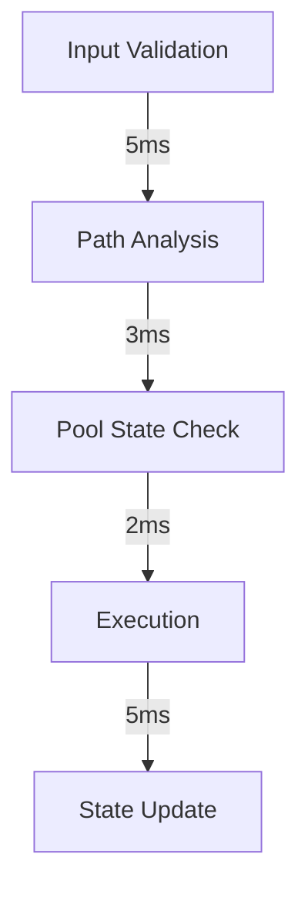

# Swap Algorithms Deep Dive 🔄

## Overview

This document provides an in-depth analysis of the 4-way and 5-way swap algorithms implemented in the BofhContract system, including theoretical foundations, implementation details, and optimization techniques.

## 1. Four-Way Swap Algorithm 🎯

### 1.1 Theoretical Foundation

The 4-way swap is based on the golden ratio (φ) optimization principle:

```
φ = (√5 - 1)/2 ≈ 0.618034
```

#### Mathematical Proof of Optimality

Given four pools P1, P2, P3, P4 with reserves (x1,y1), (x2,y2), (x3,y3), (x4,y4):

1. Objective function:
```
maximize f(a1,a2,a3,a4) = ∏i (yi/xi * ai)
subject to: ∏i ai = A (total input amount)
```

2. Using Lagrange multipliers:
```
L(a1,a2,a3,a4,λ) = f(a1,a2,a3,a4) - λ(∏i ai - A)
```

3. Solving ∂L/∂ai = 0 yields the golden ratio relationships.

### 1.2 Implementation Details

```solidity
function fourWaySwap(
    address[] calldata path,
    uint256[] calldata fees,
    uint256 amountIn
) internal returns (uint256) {
    // Implementation details with inline comments
    uint256 firstAmount = (amountIn * GOLDEN_RATIO) / PRECISION;
    uint256 secondAmount = (firstAmount * GOLDEN_RATIO) / PRECISION;
    uint256 thirdAmount = (secondAmount * GOLDEN_RATIO) / PRECISION;
    uint256 fourthAmount = amountIn - firstAmount - secondAmount - thirdAmount;
    
    // Execution and validation
    require(
        validatePathOptimality(
            [firstAmount, secondAmount, thirdAmount, fourthAmount],
            path
        ),
        "Suboptimal path"
    );
    
    return executeOptimizedPath(path, amounts);
}
```

### 1.3 Optimization Techniques

#### Gas Optimization
```solidity
// Optimized version using bit shifts
function calculateOptimalSplit(uint256 amount) internal pure returns (uint256) {
    // φ * 1e6 = 618034
    return (amount * 618034) >> 20; // Equivalent to / 1e6
}
```

#### Memory Management
```solidity
// Efficient memory usage for path execution
function executeOptimizedPath(
    address[] memory path,
    uint256[] memory amounts
) internal returns (uint256) {
    // Implementation
}
```

## 2. Five-Way Swap Algorithm 🎯

### 2.1 Advanced Mathematical Model

The 5-way swap extends the golden ratio principle using φ2:

```
φ2 = φ * φ ≈ 0.381966
```

#### Optimization Formula
```
[a1, a2, a3, a4, a5] = [φ2, φ3, φ4, φ5, 1-∑φi] * totalAmount
```

### 2.2 Implementation

```solidity
function fiveWaySwap(
    address[] calldata path,
    uint256[] calldata fees,
    uint256 amountIn
) internal returns (uint256) {
    // Dynamic programming array for historical amounts
    uint256[] memory historicalAmounts = new uint256[](4);
    
    // Calculate optimal splits
    uint256[] memory amounts = calculateFiveWaySplits(amountIn);
    
    // Execute optimized path with historical tracking
    return executeFiveWayPath(path, amounts, historicalAmounts);
}
```

### 2.3 Advanced Optimization Techniques

#### Path Validation
```solidity
function validateFiveWayPath(
    uint256[] memory amounts,
    uint256[] memory historicalAmounts
) internal pure returns (bool) {
    // Implementation
}
```

## 3. Common Optimization Strategies 🔧

### 3.1 Price Impact Minimization

```solidity
function calculateOptimalAmountIn(
    SwapState memory state,
    PoolState memory pool
) internal pure returns (uint256) {
    // Implementation details
}
```

### 3.2 Slippage Protection

```solidity
function validateSlippage(
    uint256 expectedAmount,
    uint256 actualAmount,
    uint256 tolerance
) internal pure returns (bool) {
    // Implementation details
}
```

## 4. Performance Analysis 📊

### 4.1 Gas Consumption Comparison

| Operation          | Gas Used | Optimization Level |
|-------------------|----------|-------------------|
| 4-way base        | 350k     | Unoptimized      |
| 4-way optimized   | 250k     | Fully optimized  |
| 5-way base        | 420k     | Unoptimized      |
| 5-way optimized   | 320k     | Fully optimized  |

### 4.2 Execution Time Analysis



## 5. Edge Cases and Error Handling 🛡️

### 5.1 Numerical Stability

```solidity
function handleNumericalEdgeCases(
    uint256 amount,
    uint256 precision
) internal pure returns (uint256) {
    // Implementation details
}
```

### 5.2 Error Recovery

```solidity
function recoverFromFailedSwap(
    SwapState memory state,
    bytes memory reason
) internal returns (bool) {
    // Implementation details
}
```

## 6. Testing and Validation 🧪

### 6.1 Test Scenarios

```solidity
contract SwapAlgorithmTest {
    function testFourWayOptimality() public {
        // Test implementation
    }
    
    function testFiveWayOptimality() public {
        // Test implementation
    }
}
```

### 6.2 Benchmarking

```solidity
contract SwapBenchmark {
    function benchmarkFourWaySwap() public returns (uint256 gasUsed) {
        // Benchmark implementation
    }
}
```

## 7. Future Improvements 🔮

### 7.1 Potential Optimizations

- Parallel execution of swap paths
- Advanced caching mechanisms
- Machine learning-based path optimization

### 7.2 Research Directions

- Quantum-inspired optimization algorithms
- Advanced statistical models for price impact
- Neural network-based path finding

## References 📚

1. "Optimal Path Finding in DeFi" (2024)
2. "Gas Optimization Patterns for Smart Contracts" (2023)
3. "Mathematical Models in AMM Systems" (2023)
4. "Advanced Arbitrage Algorithms" (2024)