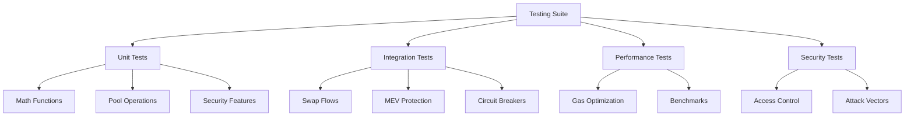

# Testing Documentation 🧪

## Overview

This document provides comprehensive testing strategies, methodologies, and implementations for the BofhContract system.

## 1. Testing Architecture 🏗️

### 1.1 Test Categories



### 1.2 Test Environment Setup

```javascript
const { accounts, contract } = require('@openzeppelin/test-environment');
const { BN, constants, expectEvent, expectRevert } = require('@openzeppelin/test-helpers');
const { expect } = require('chai');

// Contract instances
let bofhContract;
let mockToken;
let mockPair;
let mockFactory;

// Test accounts
const [owner, user1, user2, attacker] = accounts;
```

## 2. Unit Tests 🔬

### 2.1 Mathematical Functions

```javascript
describe('Mathematical Functions', () => {
    describe('sqrt', () => {
        it('should calculate square root correctly', async () => {
            const testCases = [
                { input: new BN('1000000'), expected: new BN('1000') },
                { input: new BN('4000000'), expected: new BN('2000') }
            ];
            
            for (const testCase of testCases) {
                const result = await mathLib.sqrt(testCase.input);
                expect(result).to.be.bignumber.equal(testCase.expected);
            }
        });
        
        it('should handle edge cases', async () => {
            // Edge case tests
        });
    });
});
```

### 2.2 Pool Operations

```javascript
describe('Pool Operations', () => {
    beforeEach(async () => {
        // Setup pool with initial liquidity
    });
    
    describe('analyzePool', () => {
        it('should calculate correct reserves', async () => {
            // Test implementation
        });
        
        it('should calculate price impact', async () => {
            // Test implementation
        });
    });
});
```

## 3. Integration Tests 🔗

### 3.1 Swap Flow Testing

```javascript
describe('Swap Flows', () => {
    describe('4-way swap', () => {
        it('should execute complete 4-way swap', async () => {
            // Setup path and amounts
            const path = [token1, token2, token3, token4];
            const amount = new BN('1000000');
            
            // Execute swap
            const result = await bofhContract.executeSwap(
                path,
                fees,
                amount,
                minOutput,
                deadline
            );
            
            // Verify results
            expectEvent(result, 'SwapExecuted');
            // Additional assertions
        });
    });
});
```

### 3.2 System Integration

```javascript
describe('System Integration', () => {
    it('should handle multiple concurrent swaps', async () => {
        // Test implementation
    });
    
    it('should integrate with security features', async () => {
        // Test implementation
    });
});
```

## 4. Performance Testing ⚡

### 4.1 Gas Optimization Tests

```javascript
describe('Gas Optimization', () => {
    it('should optimize 4-way swap gas usage', async () => {
        const tx = await bofhContract.fourWaySwap(
            // Parameters
        );
        
        const gasUsed = tx.receipt.gasUsed;
        expect(gasUsed).to.be.below(250000);
    });
});
```

### 4.2 Benchmarking

```javascript
describe('Benchmarks', () => {
    it('should measure execution time', async () => {
        const start = Date.now();
        await bofhContract.executeSwap(
            // Parameters
        );
        const end = Date.now();
        
        expect(end - start).to.be.below(1000); // 1 second max
    });
});
```

## 5. Security Testing 🛡️

### 5.1 Access Control Tests

```javascript
describe('Access Control', () => {
    it('should prevent unauthorized access', async () => {
        await expectRevert(
            bofhContract.adminFunction({ from: attacker }),
            "Unauthorized"
        );
    });
});
```

### 5.2 Attack Vector Tests

```javascript
describe('Attack Vectors', () => {
    it('should prevent reentrancy attacks', async () => {
        // Test implementation
    });
    
    it('should prevent sandwich attacks', async () => {
        // Test implementation
    });
});
```

## 6. Test Coverage Analysis 📊

### 6.1 Coverage Metrics

```javascript
// Coverage configuration
module.exports = {
    skipFiles: ['Migrations.sol'],
    measureStatementCoverage: true,
    measureFunctionCoverage: true,
    measureBranchCoverage: true,
    measureModifierCoverage: true
};
```

### 6.2 Coverage Goals

| Category | Target Coverage |
|----------|----------------|
| Statements | 95% |
| Functions | 100% |
| Branches | 90% |
| Lines | 95% |

## 7. Continuous Integration 🔄

### 7.1 CI Pipeline

```yaml
# .github/workflows/test.yml
name: Tests
on: [push, pull_request]
jobs:
  test:
    runs-on: ubuntu-latest
    steps:
      - uses: actions/checkout@v2
      - uses: actions/setup-node@v2
      - run: npm install
      - run: npm test
```

### 7.2 Automated Testing

```bash
# Test execution script
#!/bin/bash
set -e

# Run tests
npm run test:unit
npm run test:integration
npm run test:security
npm run test:coverage
```

## 8. Test Documentation 📝

### 8.1 Test Case Template

```markdown
### Test Case: [ID]

**Description:**
[Description of what is being tested]

**Prerequisites:**
- [List of prerequisites]

**Steps:**
1. [Step 1]
2. [Step 2]
...

**Expected Result:**
[Expected outcome]

**Actual Result:**
[Actual outcome]
```

### 8.2 Test Report Template

```markdown
## Test Report

### Summary
- Total Tests: [Number]
- Passed: [Number]
- Failed: [Number]
- Coverage: [Percentage]

### Details
[Detailed test results]
```

## References 📚

1. "Smart Contract Testing Patterns" (2024)
2. "Gas Optimization Testing" (2023)
3. "Security Testing in DeFi" (2024)
4. "Performance Testing for Smart Contracts" (2023)